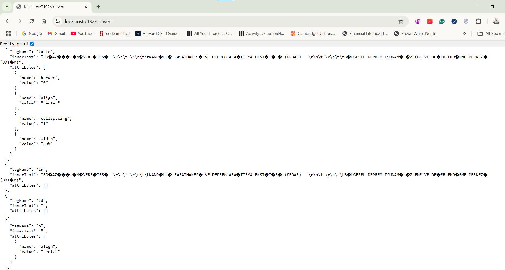
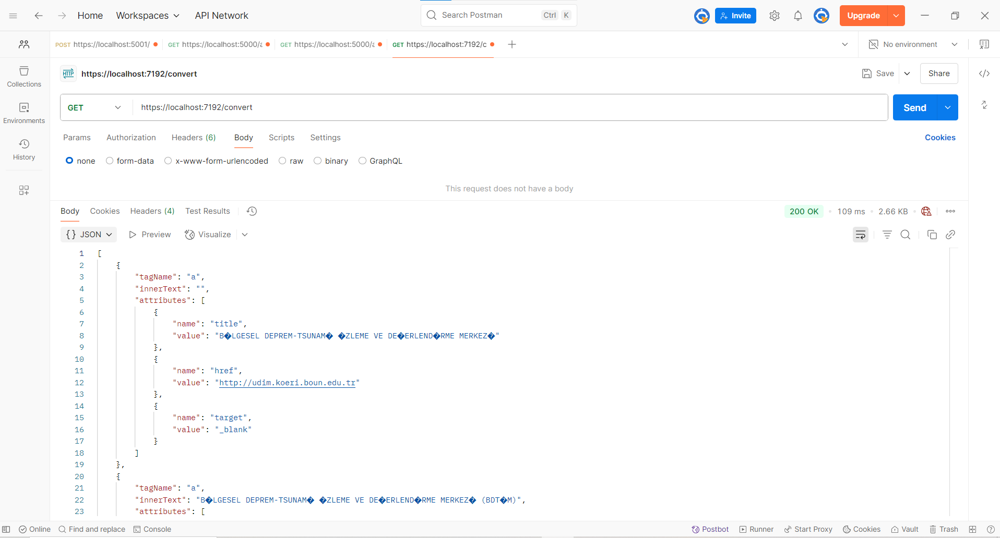

# Adapter_HTML (HTML to JSON Web API/.NET 8)


This project is a lightweight **.NET 8 Web API** that converts HTML content into structured JSON. It uses [HtmlAgilityPack](https://html-agility-pack.net/) to parse HTML and allows XPath filtering to extract specific parts of HTML. The API is designed with clean separation between models, settings, and service logic, which is ideal for microservice-based architectures.

---

## Features

- ✅ Converts raw HTML into structured JSON
- 🔎 Supports optional XPath filtering to select specific HTML nodes
- 🌐 Web API powered by ASP.NET Core (.NET 8)
- ⚙️ Configurable base URL, endpoint, and XPath via dependency injection
- 💡 Simple, testable, and clean architecture
- 🧩 Uses `HttpClientFactory` for efficient and reusable HTTP requests

---

## 📁 Project Structure
```markdown
Adapter\_HTML/
├── TagModel.cs             // Model for HTML elements and attributes
├── AttributeModel.cs       // Sub-model for HTML attributes
├── HtmlAdapterSettings.cs  // Config: base URL, endpoint, XPath, etc.
├── HtmlToJsonConverter.cs  // Core logic: fetch, parse, and convert HTML
├── Program.cs              // Web API entry point and service configuration

```

---

## How to Run the Project (Using Visual Studio 2022)

1. Open the .sln file in Visual Studio 2022.
2. Ensure that Adapter_HTML is set as the startup project.
3. Press F5 or click the Start button (▶️) to run the application.
4. Once the application is running, the Swagger UI will open automatically at:
https://localhost:{PORT}/swagger (replace {PORT} with your actual port number).
5. In Swagger UI, locate the /convert endpoint under the appropriate controller.
6. Click Try it out, then Execute to send a request.
The API will respond with JSON data based on the XPath and other settings defined in your appsettings.json.

![API response tested on Swagger UI].(README/XPath_a.png)

---

## 📬 Sample Configuration (from appsettings.json)

```json
{
  "HtmlAdapter": {
    "BaseUrl": "http://www.koeri.boun.edu.tr",
    "Endpoint": "/scripts/sondepremler.asp",
    "XPath": "//a"
  }
}
```

---

## 📤 Sample JSON Output

```json
[
  "tagName": "a",
        "innerText": "",
        "attributes": [
            {
                "name": "title",
                "value": "B�LGESEL DEPREM-TSUNAM� �ZLEME VE DE�ERLEND�RME MERKEZ�"
            },
            {
                "name": "href",
                "value": "http://udim.koeri.boun.edu.tr"
            },
            {
                "name": "target",
                "value": "_blank"
            }
        ]
]
```


---

## 📦 Dependencies

* [.NET 8 SDK](https://dotnet.microsoft.com/en-us/download/dotnet/8.0)
* [HtmlAgilityPack](https://www.nuget.org/packages/HtmlAgilityPack)
* ASP.NET Core Web API

---
## 🧪 API Testing

I have also tested the API endpoints using Postman to verify that the JSON responses are returned correctly and formatted as expected.


---
## 🤝 Contributing

Contributions are welcome! Feel free to fork the repository and submit a pull request with improvements, bug fixes, or ideas.
